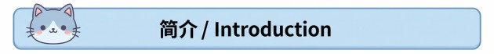
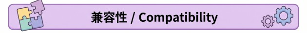

# Faction Race Diversity / 阵营种族多样性

> **RimWorld 1.6 · Highly experimental / 高度实验性**



**⚠️ 这是一个很不稳定的实验性模组。** 阵营、种族、人物种类和异种之间的生成关系非常复杂，尤其在大型模组列表、多个同种族阵营扩展并存或特殊袭击规则下，仍可能出现比例偏差、保留原种族、生成失败或红字。请先备份存档，并在正式游玩前用新档测试你的模组组合。

**⚠️ This is a highly unstable, experimental mod.** Faction, race, PawnKind and xenotype generation interact in complicated ways. Large mod lists, multiple faction expansions for the same race, and special raid roles may still cause wrong proportions, preserved original races, failed generation or errors. Back up your saves and test your exact mod list in a new game first.

阵营种族多样性让你在 **“选项 → 模组设置 → 阵营种族多样性”** 中，为每个已加载的人形阵营分别调整成员种族比例，并为每个种族设置独立的异种比例。它只影响之后新生成的人物，不会批量改写已有角色。

Faction Race Diversity adds per-faction race proportions and per-race xenotype pools to the mod settings. It affects newly generated pawns only and does not rewrite existing pawns.


| 功能 / Feature | 实际效果 / What it does |
|---|---|
| **按阵营设置种族比例** | 每个安全支持的人形阵营拥有独立的 Human、HAR 及其他人形 Race 权重。 / Each safely supported humanlike faction gets its own race weights. |
| **每个种族独立异种池** | Human、Ratkin、Axolotl 等 Race 分别保存自己的异种比例，避免把一个种族的异种混进另一个种族。 / Every race keeps a separate xenotype pool. |
| **覆盖常见生成路线** | 普通袭击、援军、访客、商队商人和护卫，以及人形商品会尽量遵守设置。动物与驮兽不参与替换。 / Raids, reinforcements, visitors, caravan traders and guards, and humanlike trade pawns are covered where safe. |
| **同种族扩展并存** | 多个同 Race 阵营扩展同时启用时，按目标阵营稳定选择人物种类变体，避免最后加载的扩展覆盖全部阵营。 / Multiple faction expansions for one race use stable per-faction PawnKind variants. |
| **两个百族阵营** | “百族同盟”与“粗野的百族同盟”在遵循原始规则时，对当前所有可用人形 Race 永久等权。 / Two bundled mixed-peoples factions keep equal weights across all available humanlike races under original rules. |
| **保留安全边界** | 任务、剧本、婴儿、变异体、特殊角色或无法找到兼容人物种类的请求会保留原始生成结果，而不是强行替换。 / Unsafe or explicitly constrained generation requests keep their original result. |
| **不会改写旧人物** | 调整只作用于之后生成的人物；已经存在的 Pawn 不会自动变化。 / Existing pawns are not converted. |

### 使用方式 / How to use

1. 打开 **选项 → 模组设置 → 阵营种族多样性**。  
   Open **Options → Mod settings → Faction Race Diversity**.
2. 选择阵营，直接调整 Race 比例；正权重 Race 会显示自己的异种比例。  
   Select a faction, edit race weights, then configure the xenotype pool shown under each positively weighted race.
3. 点击 **遵循原始规则** 可删除外部阵营的自定义覆盖；两个内置阵营会恢复所有当前人形 Race 等权。  
   **Follow original rules** removes custom overrides for external factions and restores equal weights for the two bundled factions.



### 版本与依赖 / Version and requirements

| 项目 / Item | 状态 / Status |
|---|---|
| RimWorld | **1.6** |
| Harmony | **必需 / Required** |
| Biotech | 可选；仅异种设置需要 / Optional; required only for xenotypes |
| Humanoid Alien Races | 可选；使用 HAR 种族时需要 / Optional; required by HAR race mods |
| Royalty、Ideology、Anomaly、Odyssey | 可选；对应 DLC 阵营与人物种类已列入内置映射 / Optional; their faction and PawnKind sets are included when loaded |

### 已明确核对的模组 / Explicitly reviewed mods

**种族模组 / Race mods**

- NewRatkinPlus
- MoeLotl Race
- Epona Dynastic Rise
- Kiiro Race
- Milira Race
- Miho, the celestial fox
- Nivarian Race
- Wolfein Race
- Gloomy Dragonian race
- Kurin HAR Edition
- Moosesian race
- Yuran race

**基因与异种扩展 / Gene and xenotype expansions**

- Ratkin Gene Expanded
- [OA]Ratkin Gene Expand
- Kiiro Race Gene Patch
- Kiiro Race - Maine Coon Xenotype (绮罗缅因异种)
- Kiiro Race - Orange Cat Xenotype (绮罗橘猫异种)
- Kiiro Race - Ragdoll Xenotype (绮罗布偶异种)
- Kiiro Race - Siamese Xenotype (绮罗暹罗异种)
- Milira Race Gene Patch
- Wolfein Race Gene Patch

**阵营扩展 / Faction expansions**

- [OA]Ratkin Faction: Oberonia aurea
- Ratkin Faction+
- Ratkin Knights+
- Ratkin: Promised land Ruleless Moustate
- Ratkin Underground+
- MoeLotl Faction Expand
- Milira Faction: Milira Imperium
- [SRC]Miho,Star Ring Corporation

**框架与可并用功能模组 / Frameworks and related functional mods**

- Harmony
- Humanoid Alien Races
- Faction Cultural Diversity / 阵营文化多样性

> 名单表示本模组内置了专门的 Race、异种、阵营或人物种类处理，**不等于所有组合都已稳定**。未列出的普通人形种族可能依靠自动匹配工作，但不作保证。  
> Listed mods have curated race, xenotype, faction or PawnKind handling. **This does not mean every combination is stable.** Unlisted humanlike races may work through automatic matching, but are not guaranteed.

### 加载顺序 / Load order

- Harmony 在本模组之前。 / Load Harmony before this mod.
- 可选种族、基因与阵营扩展尽量放在本模组之前。 / Load optional race, gene and faction mods before this mod.
- 不建议在重要存档中一次加入或移除大量相关种族模组。 / Avoid adding or removing many related race mods at once in an important save.


### 中文

**会修改已经存在的人物吗？**  
不会。设置只影响之后新生成的人物。

**可以中途加入存档吗？**  
模组不会批量改写已有 Pawn，但当前版本很不稳定。请先备份存档，并在副本或新档中验证后再决定是否长期使用。

**为什么某个人物仍然是原来的种族？**  
任务、剧本、婴儿、变异体、特殊角色、强制异种或缺少兼容人物种类时，本模组会优先保留原始生成结果，避免无休止重试或生成失败。

**为什么设置了 100% 仍可能不完全符合？**  
特殊袭击角色、固定任务角色和第三方模组自定义生成入口可能带有额外限制。请在 GitHub Issues 提交日志、模组列表、目标阵营与预期 Race。

**中文交流与反馈**  
QQ群：**672646837**

### English

**Does it change existing pawns?**  
No. Only newly generated pawns are affected.

**Can it be added to an existing save?**  
It does not batch-convert existing pawns, but the current release is highly unstable. Back up the save and test on a copy or in a new game first.

**Why did a pawn keep its original race?**  
Quest pawns, scenario pawns, babies, mutants, special roles, hard-forced xenotypes, or requests without a compatible PawnKind are intentionally left unchanged.

**Why can a 100% setting still miss some pawns?**  
Special raid roles, fixed quest pawns and custom generation paths from other mods may impose extra constraints. Please report the log, mod list, faction and expected race in GitHub Issues.


- Repository: <https://github.com/269435403/FactionRaceDiversity>
- Bugs and compatibility reports: <https://github.com/269435403/FactionRaceDiversity/issues>
- 中文交流群：QQ **672646837**

## Build and validation

```powershell
dotnet build .\Source\MixedPeoplesFactions\MixedPeoplesFactions.csproj --configuration Release --nologo /p:RimWorldDir="<RimWorld install directory>"
python .\测试\运行静态测试.py
```

The release assembly is written to `1.6/Assemblies/MixedPeoplesFactions.dll`. A successful build and static test do not replace an in-game test with the intended mod list.

Development notes, compatibility rules, test matrices and the generated Def wiki are included in this repository.
